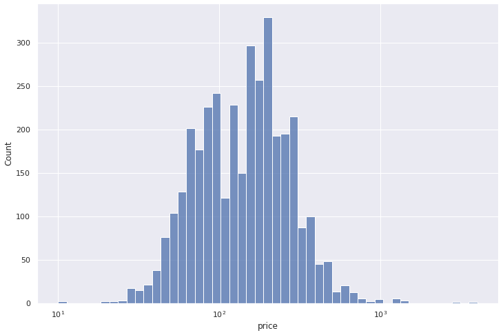
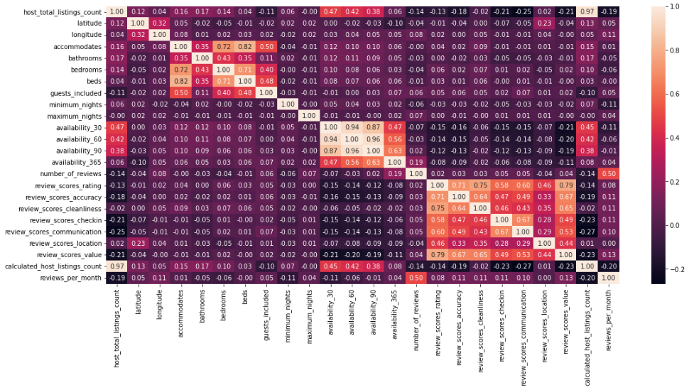

# Analysis of AirBnB Boston data

The motivation for this article is simply to practice basic prediction algorithms on a data set and achieve imrpoving predictions in the process.

The intended audience for this article is absolute beginners in the field of machine learning/data science.

## The price is skewed
Well, wherever there is money or wealth, the distribution of it is skewed, likely following a [Pareto distribution](https://en.wikipedia.org/wiki/Pareto_distribution). The price of Boston Airbnb listings is no exception as the graph below show:

A more balanced view of the price distribution is shown below on a log scale:

Working with unbalanced data is challenging, but let's work on it nevertheless. The problem: predicting the price of Boston Airbnb listings based on a number of features made vailable by Airbnb.

We'll follow the established methodology [CRISP-DM](https://en.wikipedia.org/wiki/Cross-industry_standard_process_for_data_mining)

The outline of this article is:

1. Business and Data Undertanding
2. Data Preparation
3. Modelling and Evaluation

### Business and Data Undertanding

The original data is from here: [Kaggle Airbnb Boston](https://www.kaggle.com/airbnb/boston)
A copy of it is in the [code repository](https://github.com/cmageanu/abnb_boston) for this analysis.

The main data, listings.csv has 3585 rows and 95 columns - a small data set.

Without the price, we are left with 94 features to choose from. 61 of them are categorical and 33 numerical. Incidentally, the price is a categorical column (string) in the form of "$1,230.00".

We could speculate that price is corelated with the size of the listing or the location. Unfortunately, the "square_feet" field is not provided for most of the listings - we'll have to drop this field from the features list.

The location is provided as latitude and longitude as well as a zip code and street number - and perhaps these are important features, we'll attempt to find out.

The mean price is close to $174 with a min, median and max vales of 10, 150 and 4000 respectively.

In the following two sections we aim to answer a few basic questions related to the price prediction endeavour:

1. Can we learn facts from just looking at the correlation between features?
2. Can we predict prices better than the simple average value of $174?
3. What are the most important features determining the price of a listing?

### Data preparation

Here, we look at separating the features in numeric and categorical ones. We remove all fields with cardinality of one (they don't have any predicting ability).

Treating missing values: we use a simple imputer replacing missing values with mean on numeric features and most frequest values on categorical features. Categorical values are then replaced by one hot encoded numeric features. As usual, here lies most of the programming effort - this analysis is no different from the saying that data science is 80% feature processing and 20% modelling.

The price is converted to numeric float with a bit of regex magic by removing the $ sign, the comma and converting the remaining string to float type.

### Modelling and Evaluation

Here we try 3 simple regression models: linear, random forest and XGBoost. To estimate the predicting ability of the models we use the mean absolute error between the predicted and actual values of the price.

With no tuning at all the order of the models in terms of predicting ability is:

1. Random Forest
2. XGBoost
3. Linear

With minimal tuning, XGBoost tops the results.

Back to the business questions now:

### Can we learn facts from just looking at the correlation between features?

Well, yes we can and we do not need much data processing for this. The following picture shows a heatmap of the autocorrelation numeric features of the data set:

### Can we predict prices better than the simple average value of $174?
### What are the most important features determining the price of a listing?

Over to you now:

1. Can you improve the predictions further using a more elaborate Grid search method as hinted here?
2. There is a reviews.csv data set included. Can you employ a sentiment analysis on the reviews and use it as an additional feature to see if this can improve the prediction model?
3. Can you try a deep learning approach as described here (fastbook link) and see whether this brings an improvement of the predictions?

