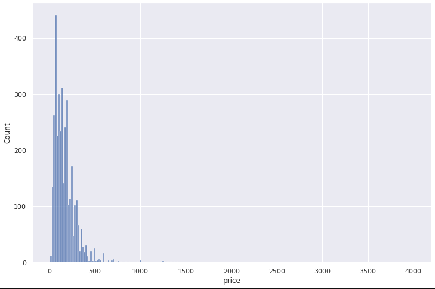

# Analysis of AirBnB Boston data

The motivation for this article is simply to practice basic prediction algorithms on a data set and achieve imrpoving predictions in the process.

The intended audience for this article is absolute beginners in the field of machine learning/data science.

## The price is skewed
Well, wherever there is money or wealth, the distribution of it is skewed, likely following a [Pareto distribution](https://en.wikipedia.org/wiki/Pareto_distribution). The price of Boston Airbnb listings is no exception as the graph below show:

A more balanced view of the price distribution is shown below on a log scale:

Working with unbalanced data is challenging, but let's work on it nevertheless. The problem: predicting the price of Boston Airbnb listings based on a number of features made vailable by Airbnb.

We'll follow the established methodology [CRISP-DM](https://en.wikipedia.org/wiki/Cross-industry_standard_process_for_data_mining)

The outline of this article is:

1. Business and Data Undertanding
2. Data Preparation
3. Modelling and Evaluation

### Business and Data Undertanding

The original data is from here: [Kaggle Airbnb Boston](https://www.kaggle.com/airbnb/boston)
A copy of it is in the [code repository](https://github.com/cmageanu/abnb_boston) for this analysis.

The main data, listings.csv has 3585 rows and 95 columns - a small data set.

Without the price, we are left with 94 features to choose from. 61 of them are categorical and 33 numerical. Incidentally, the price is a categorical column (string) in the form of "$1,230.00".

We could speculate that price is corelated with the size of the listing or the location. Unfortunately, the "square_feet" field is not provided for most of the listings - we'll have to drop this field from the features list.

The location is provided as latitude and longitude as well as a zip code and street number - and perhaps these are important features, we'll attempt to find out.

The mean price is close to $174 with a min, median and max vales of 10, 150 and 4000 respectively.

In the following two sections we aim to answer a few basic questions related to the price prediction endeavour:

1. Can we learn facts from just looking at the correlation between features?
2. Can we predict prices better than the simple average value of $174?
3. What are the most important features determining the price of a listing?

### Data preparation

Here, we look at separating the features in numeric and categorical ones. We remove all fields with cardinality of one (they don't have any predicting ability).

Treating missing values: we use a simple imputer replacing missing values with mean on numeric features and most frequest values on categorical features. Categorical values are then replaced by one hot encoded numeric features. As usual, here lies most of the programming effort - this analysis is no different from the saying that data science is 80% feature processing and 20% modelling.

The price is converted to numeric float with a bit of regex magic by removing the $ sign, the comma and converting the remaining string to float type.

### Modelling and Evaluation

Here we try 3 simple regression models: linear, random forest and XGBoost. To estimate the predicting ability of the models we use the mean absolute error between the predicted and actual values of the price.

With no tuning at all the order of the models in terms of predicting ability is:

1. Random Forest
2. XGBoost
3. Linear

With minimal tuning, XGBoost tops the results.

Back to the business questions now:

### Can we learn facts from just looking at the correlation between features?

Well, yes we can and we do not need much data processing for this. The following picture shows a heatmap of the autocorrelation numeric features of the data set:

Perhaps unsurprisingly, the following features show a significant degree of correlation: accomodates, bathrooms, bedrooms, beds, guests_included. They all describe in one way or another the capacity of the listing to accomodate people - so some degree of correlation is expected.

Another cluster of correlated features is the availability_30/60/90/365. Success is always unequally distributed, and the availability measures perhaps the (lack of) success of the listings. Popular listings will tend to be fully booked for most of the time while unpopular hosts will list availability for most of the foreseable periods: 30/60/90/365 days in the future - hence the significant correlation of these features. 

The availability features also show correlation with calculated_host_listings_count and host_total_listings_count, again, somewhat expected: the more listings there are per host, the more likely some of them will be available.

Finally there is a correlated cluster of features describing reviews - 7 of them. That means people tend to provide consistent reviews - be them on the positive or negative side.

### Can we predict prices better than the simple average value of $174?

Yes, we can with minimal effort. Here are the scores of mean_absolute_error metric for a few regression algorithms:

|Type of regressor | mean_absolute_error|
|--|:--:|
Simple mean|88.58
Linear|61.07
Random Forest| 52.69
XGBoost with minimal tuning| 52.39

As mentioned before, with no tuning at all, XGBoost performs worse than Random Forest, producing a mean_bsolute error of 56.43. You can see the details in the [code](https://github.com/cmageanu/abnb_boston).

### What are the most important features determining the price of a listing?

Both Random Forest and XGBoost models produce feature importance data sets, revealing the importance of the features in the model produced. Let's have a look at the top 10 features:

#### Random Forest

|Feature|Weight|
|:-|-:|
|x7_Entire home/apt|	2.337478e-01
|longitude	|1.685984e-01
|bathrooms	|1.195159e-01
|latitude	|7.500666e-02
|availability_365|	3.293117e-02
|availability_90	|2.701877e-02
|bedrooms	|2.590484e-02
|availability_60|	2.575944e-02
|availability_30|	2.459939e-02
|minimum_nights	|2.425289e-02

#### XGBoost

|Feature|Weight|
|:-|-:|
|x7_Entire home/apt	|0.411931
|bathrooms|	0.092844|
|bedrooms	|0.062154|
|x3_f	|0.049112|
|x10_super_strict_30|	0.033150|
|longitude	|0.029080|
|availability_30|	0.026993|
|accommodates	|0.019304|
|x12_f	|0.015631|
|availability_60|	0.015571|

Top spot on both algorithms is "x7_Entire home/apt" which is a categorical value present in the initial field room_type. So, whether you share the property or not with someone else has the most impact on the price. Perhaps people prefer not to share the property during their stay thus driving up prices for this type of listing.

Bathrooms and bedrooms also have a big impact on the price as well as the availability. Again, not surprising, the bigger the house the bigger the number of bathrooms and bedrooms which drives the price up.

On the location, both alghoritms give a high rank to the longitude. Latitude is also important but less so, ranking 4th on Random Forest and not event making the top 10 for XGBoost (but close - it takes the 11th spot). Location matters but it seems the Est-West position is more important than the North-South one - this may mean something to people familiar with the Boston area.

## Conclusion:

In this article, we had a brief look at the Airbnb listings for the Boston area, following the CRISP-DM steps. We tried to predict the price of the listings while making fast common decisions in regards to missing values and encoding categorical values. The predictions for the price seem reassuring and features make business sense when looked at from a correlation or a model perspective.

Over to you now:

1. Can you simplify the model(s) by making a trade-off between the numbers of features and the precision of the model(s)?
2. Can you improve the predictions further using a more elaborate Grid search method ? Is it worth the effort?
3. There is a reviews.csv data set included. Can you employ a sentiment analysis on the reviews and use it as an additional feature to see if this can improve the prediction model?
4. There is a calendar.csv dataset as well. It would be interesting to study the variability of the prices from a seasonal perspective as well as around public US holidays and major periodic events taking place in Boston.
